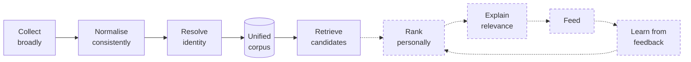

# Architecture

## What this architecture is for

Academious is a personalised ranking and discovery layer over scientific
literature ([product.md](product.md)). That intent explains the shape of
everything below: the system's eventual job is to decide which few papers
deserve one person's attention, and it cannot rank what it never collected,
cannot compare what it failed to deduplicate, and cannot explain a
recommendation whose provenance it did not keep.



Solid is implemented; dashed is designed and unbuilt.

Everything from `collect` to `retrieve` runs today. Everything after it is
designed and unbuilt: there are no accounts, no interest model, no feedback
signals, and the browsable feed is reverse-chronological rather than ranked. The
recommendation design that ranking will be built against is
[phase-0-report §6](phase-0-report.md#6-recommendation-engine).

## Shape

One FastAPI application, one PostgreSQL, background workers in the same
codebase, one deployable image. A modular monolith, not microservices: the whole
system is meant to be maintainable by one developer, and service boundaries
would cost more than they buy at this scale.

```
src/academious/
  core/        config, logging, errors, clock, identifier and text normalisation,
               rate limiting, HTTP
  db/          SQLAlchemy models and session management
  sources/     connector protocol + one package per source
  ingest/      harvest orchestration, deduplication, merge precedence, OA,
               relations, retractions
  jobs/        PostgreSQL work queue
  embeddings/  SPECTER2 backends, input construction, vector persistence, jobs
  retrieval/   lexical, semantic and hybrid search; filters
  eval/        benchmark queries, relevance judgments, IR metrics, harness
  workers/     scheduled entry points (CLI)
  api/         FastAPI app (Phase 2: health and metrics only)
```

Files stay small - roughly 200-400 lines, 800 as a hard ceiling. A connector that
outgrows one file splits into `client.py` (network) and `normalise.py` (pure).

## The pipeline

```
  cron ──▶ 1. HARVEST       per-source, rate-limited, cursor-resumable
                            → source_record (raw JSONB, immutable)
              │
              ▼
           2. NORMALISE     raw → PaperCandidate. Pure function.
              │
              ▼
           3. CANONICALISE  identifier match → fuzzy match → merge or insert
              │
              ▼
           4. ENRICH        OA locations, retraction status, topics, venue
              │
              ▼
           5. INDEX         tsvector, trigram          (vector: Phase 3)
```

Every stage is **global**, not per-user. A paper is fetched once, normalised
once, deduplicated once and enriched once, then reused by every reader. That is
the property that makes a free tier affordable; it is enforced by the fact that
no user identity exists anywhere in `ingest/`.

## The connector contract

```python
class SourceConnector(Protocol):
    key: str
    def harvest(self, since: date | None, cursor: str | None) -> Iterator[HarvestPage]: ...
    def normalise(self, raw: RawRecord) -> PaperCandidate | None: ...
```

`harvest` is the only code that touches the network. `normalise` is pure - no
I/O, no clock, no randomness - so it is tested against payloads recorded from
the live APIs, with no network access. Adding a source means writing those two
methods and adding one line to `sources/registry.py`.

## Rate limiting

Every outbound request passes through a token bucket keyed by source
(`core/ratelimit.py`), configured at or below each source's published ceiling.
This is contractual, not cosmetic: arXiv permits one request per three seconds
across all of a client's machines, and NCBI enforces its limits with IP bans.

A 429 penalises the bucket for the whole process, so a `Retry-After` is honoured
by every subsequent caller rather than only the request that received it.

Buckets are process-local, which is correct for the approved single-worker
deployment. Adding a second worker process means either partitioning workers by
source or moving buckets to a shared store.

## HTTP

`core/http.SourceHttpClient` wraps httpx with retry, full-jitter backoff, and an
error hierarchy that distinguishes:

* `TransientSourceError` - timeout, connection failure, 5xx. Retry.
* `RateLimitedError` - 429. Retry, honouring `Retry-After`, and penalise the bucket.
* `PermanentSourceError` - 4xx other than 429, or an unparseable payload. Do not retry.

That distinction is what lets a harvest survive an outage without hammering a
source that is telling us the request itself is wrong.

## Job queue

A `job` table drained with `SELECT ... FOR UPDATE SKIP LOCKED`. At roughly 30k
jobs/day PostgreSQL handles this comfortably, and it keeps Redis, a broker and a
result backend out of the deployment (ADR 0002). Jobs support dedup keys,
priorities, delayed execution, bounded attempts and exponential backoff.

Redis arrives when it earns its place as a *cache* - feed candidates, hot paper
pages, shared rate-limit buckets - not as a broker.

## Scheduling

External: cron or systemd timers invoking `python -m academious.workers <command>`.
Explicit, greppable, and a failure surfaces in the scheduler's own logs rather
than being swallowed by an in-process scheduler.

## Observability

`ingestion_run` is the metrics store: one row per source per run, with records
fetched and skipped, papers created, updated and merged, relations and OA
locations created, error count, error samples, and the cursor window. It is
queryable over HTTP at `/metrics/ingestion`.

Logs are structured (structlog), JSON in production. Every ingestion decision
that changes the corpus - a merge, a conflict kept separate, a preprint link, a
retraction applied - emits an event with the paper ids involved.

## Deployment

Approved target: a single Hetzner VPS running Docker Compose with reverse proxy,
frontend, FastAPI, PostgreSQL + pgvector, and one background worker. No Redis,
no Celery, no Kubernetes, no standalone vector database.

Backups are a Phase 1 design obligation and a Phase 6 implementation task:
production must take **encrypted, off-machine** backups rather than relying on
the VPS disk. See [deployment.md](deployment.md).
