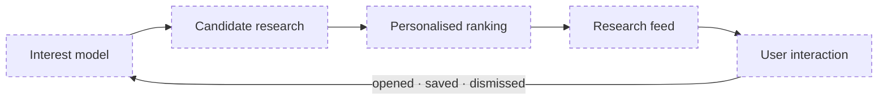
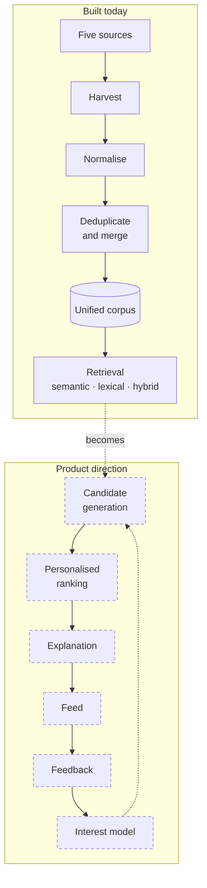

# Product

What Academious is for, what it currently does, and what it is being built to
become. This is the document to read when a wording question comes up: if
another document contradicts this one about *purpose*, this one is right and the
other one needs fixing.

Engineering documents own their own subjects. This one owns positioning.

---

## 1. What Academious is

> **Academious is a personalised discovery layer over scientific literature. It
> is being built to learn what research a person cares about and surface new
> work likely to deserve their attention.**

Shorter, where a sentence is all there is room for: *a personalised research
discovery feed*.

The consumer analogy is Spotify or YouTube — not because those products invented
recommendation, and not because Academious copies them, but because they changed
the interaction model. You do not have to know what you want before you open
them. Academious wants the same shift for research literature.

The analogy belongs in a README or a landing page. Architecture documents should
say *personalised ranking and discovery layer over scientific literature*, which
is the same claim without the metaphor.

## 2. The question, in order

Academious exists to answer three questions, and the order is the product:

1. **What new research came out that I would probably care about?**
2. **Why should I care about it?**
3. **Help me understand it.**

Discovery comes first. Explanation and understanding are how a recommendation
becomes actionable, not what the product is. A summariser that cannot decide
what to summarise has skipped the hard part.

## 3. The problem

More research is published than any person can monitor. The people who most
need to keep up — students, researchers, engineers, clinicians, founders,
analysts — cannot continuously watch every journal, repository, conference,
author and adjacent field that might matter to them.

Relevant work shows up in inconvenient places: outside the journals someone
reads, under terminology they would not have searched, from authors they have
never heard of, in a neighbouring discipline, as a preprint, or at a moment when
they are not running a literature search at all.

So the scarce resource is not access. It is attention. The useful question has
shifted from *where can I search for papers?* to **which of the thousands of
papers published recently are worth my time?**

That is a ranking problem, and it is the problem Academious is built around.

## 4. Search and discovery are different

**Search starts with intent.** "Find me papers about retrieval-augmented
generation." The user already knows what they want; the system's job is to
match it.

**Discovery starts with the user.** "Based on what you know about me, what
should I know about?" The user may not know the paper exists, who wrote it, or
what to type to find it.

Both matter, and Academious supports search today. But discovery is the
defining experience:

> Search helps you find what you are looking for. Academious should help you
> find what you did not know to look for.

The principle underneath:

> A user should not need to know a paper exists in order for Academious to help
> them find it.

## 5. Product hierarchy

Five layers, in dependency order. Each is only worth building because the one
above it works.

### 1. Personalise — understand what the user cares about

An evolving representation of interests: fields, subfields, recurring themes,
authors, methods, applications, interdisciplinary overlaps, and how all of that
changes over time. Richer than a saved list of keywords.

### 2. Discover — continuously find candidates

The system watches the corpus so the user does not have to run a search to
learn something new.

### 3. Rank — decide what deserves attention

The hard part. Five thousand relevant papers is not an answer; it is the
problem restated. Ranking eventually has to weigh relevance, recency, novelty,
quality signals, user affinity, author affinity, diversity, interdisciplinary
reach, exploration against exploitation, negative feedback, and what the user
has already seen.

### 4. Explain — say why this paper, for this person

A recommendation that arrives without context costs the user more than it saves.
Research is expensive to evaluate: a song can be sampled in seconds, a paper
cannot. A feed item should make it cheap to answer *what is this, why am I
seeing it, what is new about it, is it worth my time?*

### 5. Understand — reduce the cost of reading

Summaries, key contributions, methods, prerequisites, limitations, comparison
with related work, question answering. This layer comes last on purpose.
Academious should answer *should I care about this paper?* before it tries to
become *a chatbot for this paper*.

## 6. The loop

Every box is dashed because none of it exists: there are no accounts, so there
is no user to model and no interaction to learn from (§7).

The compounding part is the return edge. Signals that could eventually feed it:
papers opened, saved, dismissed, marked irrelevant; time spent; topics and
authors followed; searches run; explicit preferences; negative feedback.

## 7. Where the product stands

The honest split between what runs and what is designed. Anything in the right
column is a direction, not a feature.

| Layer | Today | Direction |
|---|---|---|
| **Corpus** | Five sources harvested, normalised, deduplicated, merged into one corpus with OA locations and retraction status | Broader coverage; scheduled, measured freshness |
| **Personalise** | *Nothing.* No accounts, no stored interests, no user model | Multi-centroid interest profiles ([phase-0-report §6.2](phase-0-report.md#62-multi-centroid-interest-profiles)) |
| **Discover** | A user supplies a research-interest description per query | Standing interests; candidate generation runs without being asked |
| **Rank** | Semantic, lexical and hybrid retrieval, ranked per query. The browsable feed is reverse-chronological and identical for everyone | Personalised ranking blending relevance, recency, novelty, quality and diversity |
| **Explain** | *Nothing.* Results carry metadata, not reasons | `argmax` over interest centroids yields the matched interest, so the first explanation needs no LLM ([phase-0-report §6.2](phase-0-report.md#62-multi-centroid-interest-profiles)) |
| **Understand** | *Nothing.* No LLM anywhere in the codebase | Summaries and explanation, after discovery works |

Two consequences worth stating plainly, because they are easy to overstate:

* **Academious is not personalised today.** Retrieval is genuinely
  query-driven: it answers the interest description it is given and forgets it.
* **The feed is not ranked.** `/papers` is newest-first
  ([`api/repository.py`](../src/academious/api/repository.py)). It demonstrates
  the corpus; it does not demonstrate discovery.

## 8. Why the ingestion architecture looks like this

The pipeline is not the product. It is what discovery needs underneath it: you
cannot recommend what you cannot see.

The solid boxes run in production. The dashed ones are designed and unbuilt —
and the arrow between the two halves is the whole remaining product: retrieval
answers a question it was asked, while candidate generation asks on the reader's
behalf.

Different sources buy different things: OpenAlex gives metadata breadth and
topic structure, arXiv and bioRxiv/medRxiv give preprint latency that OpenAlex
cannot match, Europe PMC gives peer-reviewed biomedical depth and MeSH terms,
Retraction Watch gives corrections. Breadth of coverage, timeliness, quality of
normalisation, and identity resolution all bound how good recommendations can
eventually be — a discovery system cannot rank what never entered the corpus,
and cannot rank sensibly across duplicates it failed to merge.

So: **ingestion creates coverage, ranking creates selectivity, personalisation
creates relevance, explanation creates comprehension.** Each layer is worth
building only to the extent the one before it holds up.

## 9. Competitive position — stated honestly

Personalised paper recommendation is **not** a new category. Existing academic
products already offer recommendations, adaptive feeds, related-paper
discovery, citation-based exploration, author following, topic alerts and
literature-review tooling. Any document claiming otherwise is wrong and should
be corrected.

The distinction Academious is betting on is **product hierarchy**, not
capability:

> Recommendation and discovery capabilities are increasingly common, but they
> usually sit inside a broader search engine, citation graph, reference manager,
> library or literature-review workflow. Academious is being designed the other
> way round: the personalised feed is the product, and search, reading,
> explanation and assistant features exist to serve it.

The useful question is not *can we recommend research papers?* — that is
answered, by several products. It is:

> **Can we build the best personalised interface between one person and a
> continuously growing body of scientific knowledge?**

Recommendation-first, not recommendation-exists.

There is no moat today. If one ever develops it will come from the combination
of a good interest model, ranking quality, accumulated feedback, coverage and
freshness, entity resolution, and feed UX — not from access to public metadata,
which anyone can have.

## 10. Who it is for

Not only professional academics. Students, PhD candidates and professors, but
also engineers, clinicians, scientists, founders, analysts, R&D teams, and
people who simply want to stay intellectually current.

The characteristic user is **someone who wants to keep up without running
formal literature searches**: a CS student who wants to know what is happening
in AI without reading arXiv listings every morning; an engineer who wants
systems and language research that matters; a medical student following several
clinical interests at once; a security professional watching for relevant
cryptography work; a researcher who wants to see the adjacent field they would
never have searched.

Students matter disproportionately. Most do not browse journals unless an
assignment forces it — not from disinterest, but because the discovery cost is
high. Knowing where to look, what to search, which papers matter and which are
readable is itself expertise. Lowering that cost is a large part of the
opportunity, and it does not mean replacing textbooks or lectures.

The interaction Academious should support that research tools usually do not:
**I have ten minutes; show me something worth knowing.**

## 11. Principles

**Discovery first.** The primary job is surfacing research worth knowing about.

**Personal relevance over generic popularity.** A highly cited paper is not
automatically the right paper for this reader.

**Reduce search effort.** Useful work should reach the user even when they never
formulated the right query.

**Explain recommendations.** A user should be able to see why something is in
their feed.

**Learn over time.** The system should get better at a person the longer they
use it.

**Preserve user control.** Personalisation must not obstruct deliberate
searching, exploring, or changing direction.

**Breadth beneath simplicity.** Many sources underneath; a simple surface on top.

**Leave room for serendipity.** Ranking only for similarity produces a narrow
filter bubble; ranking only for novelty produces noise. Adjacent fields,
unexpected connections, emerging topics and unfamiliar authors are part of what
makes discovery worth opening. The exploration/exploitation balance is a
long-term ranking concern, not a solved one.

**Freshness, but not only recency.** The product question contains the word
*new*, and ingestion cadence matters accordingly. But an older paper can be
exactly right when it is foundational to something being read, or when the
reader's interests have moved. Optimise for *what deserves attention now*, not
*what was published today*.

## 12. What Academious is not

It may eventually contain capabilities associated with each of these. None of
them should define it:

an AI research assistant · a Google Scholar replacement · an academic search
engine · a PDF chatbot · a paper summariser · a citation manager · a
systematic-review platform · a reference manager · a literature-review generator

Supporting capabilities — search, citation networks, related-paper exploration,
summaries, author and topic pages, collections, alerts, citation export — earn
their place by answering one question: **does this improve personalised
discovery, evaluation, or understanding?** If a feature cannot answer it, it is
not a pillar, whatever else it is.

## 13. North star

> **Did Academious help this user discover research they genuinely cared about
> and would otherwise have missed?**

Not searches performed, not PDFs summarised, not corpus size. Corpus size is a
precondition; the value is created by what gets selected out of it.

The internal test for a feed item is the reaction it should produce:

> *I didn't know this paper existed, and I'm glad you showed it to me.*

Recommendation quality is the thing the product lives or dies on, and it will
eventually need measuring as rigorously as retrieval is measured today — see
[evaluation.md](evaluation.md) for the harness that exists, which currently
measures query relevance rather than recommendation usefulness. Ranking quality,
saves, dismissals, reading behaviour, diversity, freshness and retention are the
directions that measurement has to grow in, and none of them can be measured
before there are users to measure.

## 14. Language

Prefer: personalised research discovery · discovery layer · personalised
ranking · research discovery feed · scientific-literature recommendation.

Use carefully, and never as the primary definition: research assistant · AI
assistant · academic search engine.

Never write: first personalised research recommender · competitors only offer
manual search · recommendations for papers do not exist yet · revolutionising
research · transforming academia · cutting-edge AI-powered platform.

Concrete beats grand. *Academious ranks papers against an evolving model of a
reader's interests* is better than *Academious transforms how humanity engages
with knowledge*, and has the advantage of being checkable.
